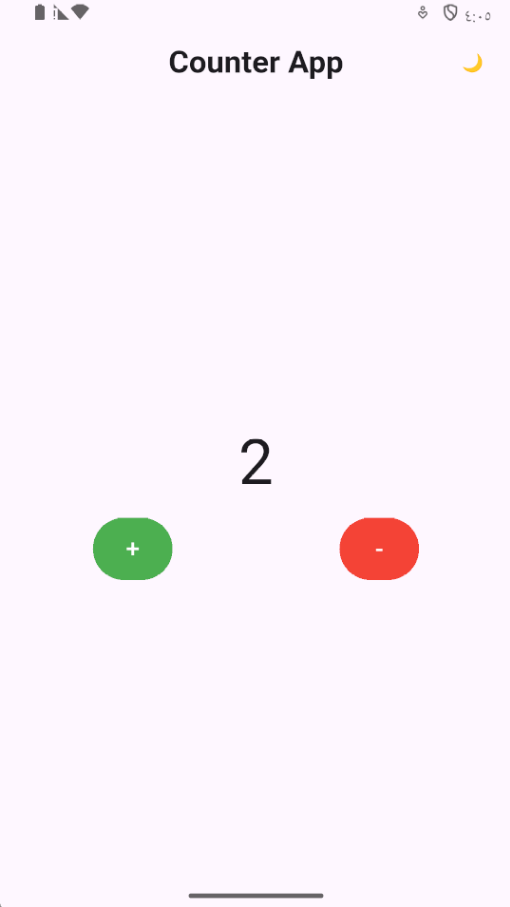
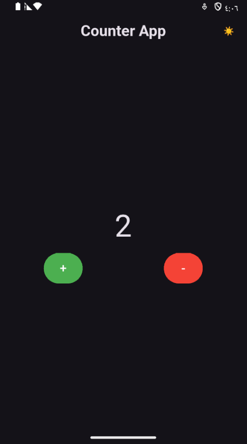

# Flutter Counter App

A clean Flutter application built to demonstrate basic state management with Cubit-based architecture and a light/dark theme toggle. It keeps the code focused on a single user flow: increment, decrement, and milestone notifications.

## Features

- Counter value updates through a dedicated Cubit
- Positive and negative milestone feedback at key thresholds
- Theme toggling with a lightweight app-wide theme Cubit
- Simple, readable widget tree with clean state handling
- Built for easy extension into a larger Flutter project

## App flow

1. The app loads with the counter starting at 0.
2. The user taps the plus or minus button to update the state.
3. The Cubit emits either a normal update or a milestone state.
4. The screen responds to the new state and shows a dialog when threshold values are reached.

## Project structure

- `lib/main.dart` — app bootstrap and provider setup
- `lib/cubits/` — Cubit and state definitions for counter and theme logic
- `lib/screens/` — screen-level UI composition
- `lib/widgets/` — reusable UI widgets
- `test/` — widget-level regression checks

## Screenshots

Add screenshots here as the project evolves.

### Home screen



### Dark mode



## Getting started

### Prerequisites

- Flutter SDK installed and configured
- An emulator or connected device

### Run locally

```bash
flutter pub get
flutter run
```

### Run tests

```bash
flutter test
```


